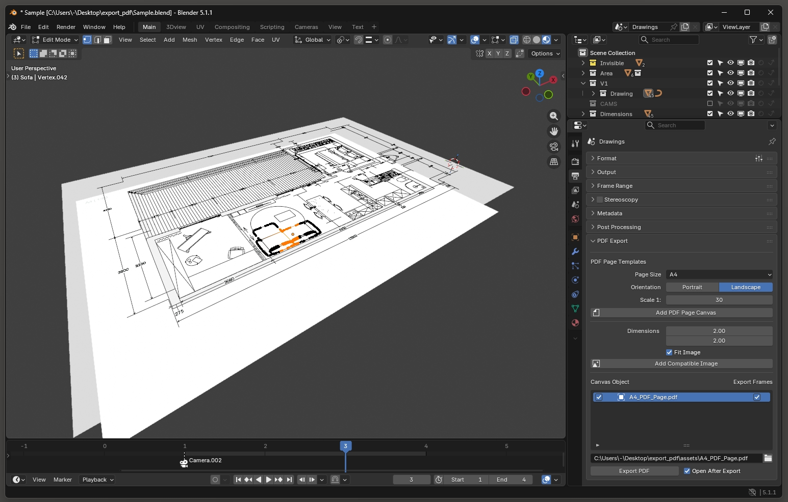
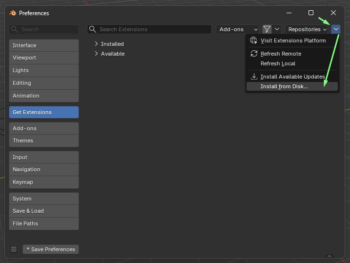
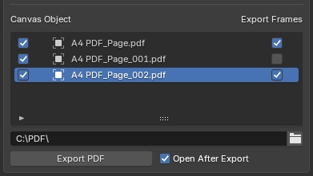
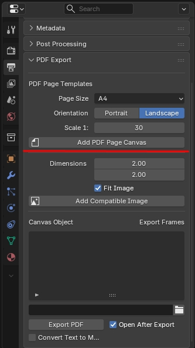
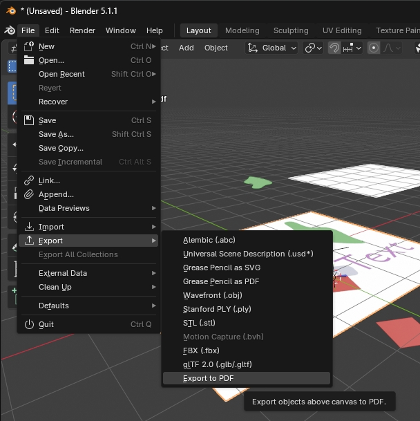

# PDF export for Blender

This is a Blender add-on for creating PDF documents. It lets you construct PDF pages on the XY plane with simple Blender objects - meshes, curves, text and empties in image mode.

## Installation

Install as any other extension - download [export_pdf-1.0.0.zip](export_pdf-1.0.0.zip) and drag and drop it on top of Blender window or choose the .zip with Install from Disk from Preferences.

 

## Features

* Supports main object types:
    * Mesh objects
    * Curve objects (Bezier splines export as such, NURBS splines export evaluated to segments)
    * Text
    * Empties in Image mode for image export
    * Instances of supported object types
* Additional strokes from edge attributes: 
    * `pdf_stroke`(float for width, 0 - ignored) 
    * `pdf_stroke_color`(color)
* Gets color from simple materials:
    * Principled BSDF(Alpha is used for transparency, if Emission Strength ≥ 1, Emission Color is used)
    * Diffuse BSDF
    * Color
    * Emission
    * Any of those mixed with Transparent BSDF
* Export multiple PDFs with frames as pages at a time:

## Usage
A mesh object is used to define the canvas for a PDF page. Any mesh objects with ".pdf" at the end of the name will be considered canvas objects. The original dimensions of a canvas object bounding box will be used as the size of the page while the scale of the object will be used as scale factor. 

For example: if you have A4 sized plane(0.297m x 0.21 m) and it's scaled up 60 times(scale is (60,60,60)) a PDF page will be A4 size and whatever is above that plane will be drawn 60 times smaller on it( 1:60 scale). You can create and name canvas objects manually or they can be created using the operator that also has some useful template sizes:

Once you have a canvas object in your scene you can start adding objects above it. 

You will see all the canvas objects in a list in the add-on's panel where you can select multiple or alternatively, you could select the one you want to export, and call the exporter from export menu:

This is work in progress, if you have questions about usage ask me. https://blenderartists.org/u/martinz/ I'll help you and that will help me write this documentation. 

## Limitations

The add-on is made for making PDF documents in Blender. This, however, does not mean it will export everything and anything that you can have in a Blender scene. While it attempts to deal with simple cases of "messy" geometry, clean geometry flat on XY plane is expected for it to work well. There are also limitations in PDF format that this add-on does not attempt to overcome like complex image or text transformations. Images and text can be rotated in Z axis only to export correctly. Scaling is fine as long as it's not negative.

* Text and image rotation is only supported in Z axis. Scale cannot be negative.
* Text alignment is not pixel perfect and slight differences in position and size may be possible.
* Most text object properties like character spacing are not supported yet
* Multiple materials assigned to text characters is not supported(first material will be used)
* Transparency rendering will not match Blender's viewport.
* Exported images will ignore scene color management

## TO DO
* UI text and descriptions
* Thorough tests, make a test scene
* Get material color improvements (fix color mix)
* Packed font support 
* Attribute/Property Preview
* Finish documentation, new screenshots/GIFs

## Ideas I am considering 
* Curve attributes
* Options for stroke joint types
* Scene unit support
* Dashed lines
