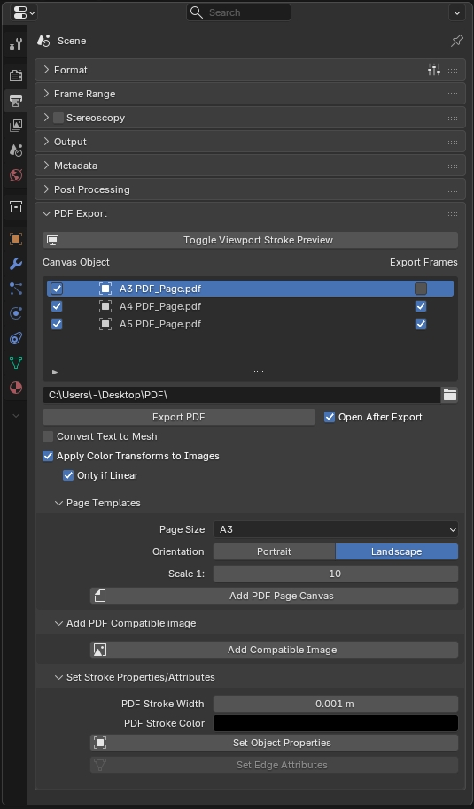
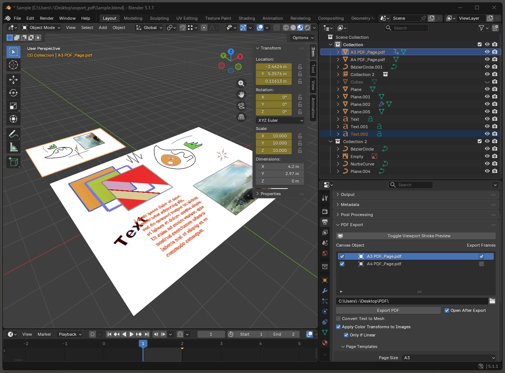
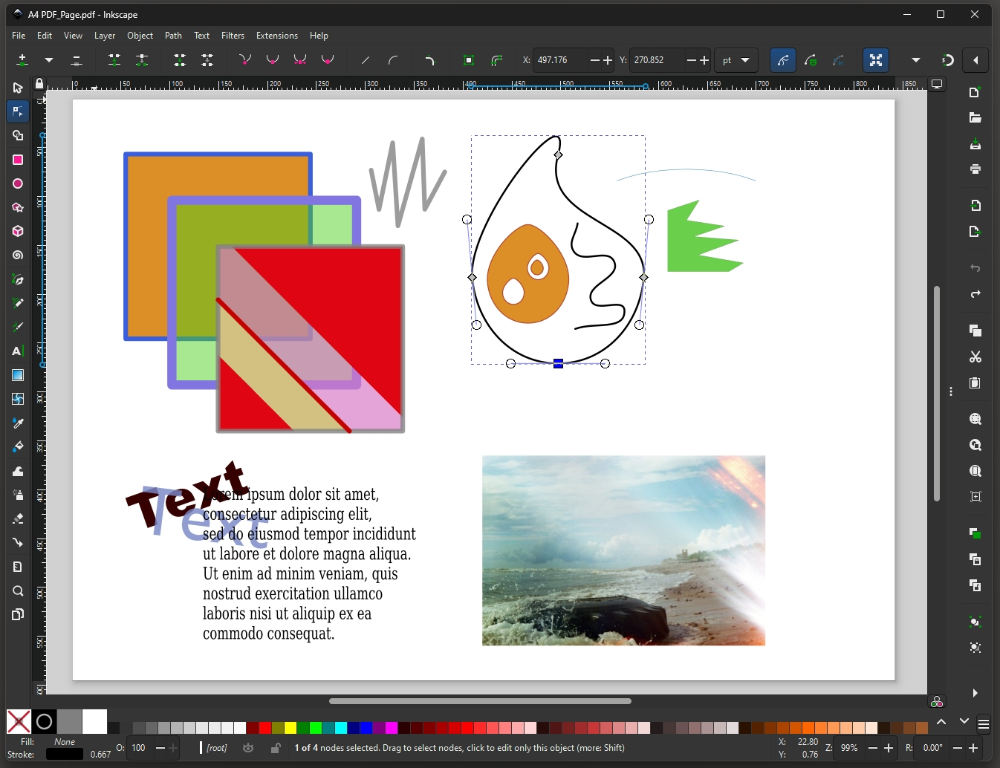

# PDF export for Blender

This is a Blender add-on for creating PDF documents. It lets you construct PDF pages on the XY plane with simple Blender objects - meshes, curves, text and empties in image mode.

## Installation

Install as any other extension - download [export_pdf-1.0.0.zip](releases/export_pdf-1.0.0.zip) and drag and drop it on top of Blender window or choose the .zip with Install from Disk from Preferences.

## Key Features

* Text with embedded fonts
* Bezier curves
* Correct instance processing(for reusing a collection instance in different documents for example)
* Stroke color and width control with custom object properties
    * `stroke_width` float, 0 - stroke disabled
    * `stroke_color` linear color, RGBA
* Additional strokes from mesh edge attributes
    * `pdf_stroke` edge float attribute, 0 - stroke disabled
    * `pdf_stroke_color` edge color attribute, RGBA
* Export multiple files with frames as pages

## Usage

PDF page canvas is defined with a simple canvas object(its bounding box) named with ".pdf" at the end. Its original dimensions are used for the page dimensions and scale is used to determine the scale factor. Canvas object can be animated to change size and position per page. Note: world space bounding box in X and Y is used, so it should probably not be rotated. 

For example: if you have A4 sized plane(0.297m x 0.21 m) and it's scaled up 60 times(scale is (60,60,60)) a PDF page will be A4 size and whatever is above that plane will be drawn 60 times smaller on it(1:60 scale). Canvas objects can be created and named manually or using the operator that also has some useful template sizes.

Objects above the canvas object will be exported as shapes on XY plane(as if looked at from above) for that canvas object's file. Strokes will be drawn on curves, loose edges and open mesh boundaries and edges marked with edge attributes(if `pdf_stroke`>0 with `pdf_stroke` value for width and `pdf_stroke_color` color). Colors for fills will be taken from simple materials: Principled BSDF, Diffuse BSDF, Emission, Color, Transparent BSDF or any of those mixed with Transparent BSDF. Empties in Image mode will be exported as images. 

You can export a single selected canvas object if you choose the Export to PDF option from File → Export menu

## Example:

## Limitations

The add-on is made for making PDF documents in Blender. This, however, does not mean it will export everything and anything that you can have in a Blender scene. While it attempts to deal with simple cases of "messy" geometry, clean geometry flat on XY plane is expected for it to work well. There are also limitations in PDF format that this add-on does not attempt to overcome like complex image or text transformations. Images and text can be rotated in Z axis only to export correctly. Text and image scaling is fine as long as it's not negative.

* Text and image rotation is only supported in Z axis. Scale cannot be negative.
* Text alignment is not pixel perfect and slight differences in position and size may be possible.
* Most text object properties like character spacing are not supported yet
* Multiple materials assigned to text characters is not supported(first material will be used)
* Transparency rendering will not match Blender's viewport.
* Images can only be rotated in Z axis to render correctly

## TO DO

* Packed font support 
* Better text properties support

## Ideas I am considering 

* Options for stroke joint types
* Scene unit support
* Switching images from Empty to Mesh type so they are color managed in the viewport

## AI Use 

AI was used when coding, however all generated code bits were very thoroughly reviewed considered and corrected/rewritten manually. So if you see something weird in the code you can rest assured that's definitely my fault, not some LLM hallucination ;) . 

## Say thanks

If this is really helpful for you and you wish to express your gratitude you can always [buy me a coffee](https://buymeacoffee.com/martynasziemys).